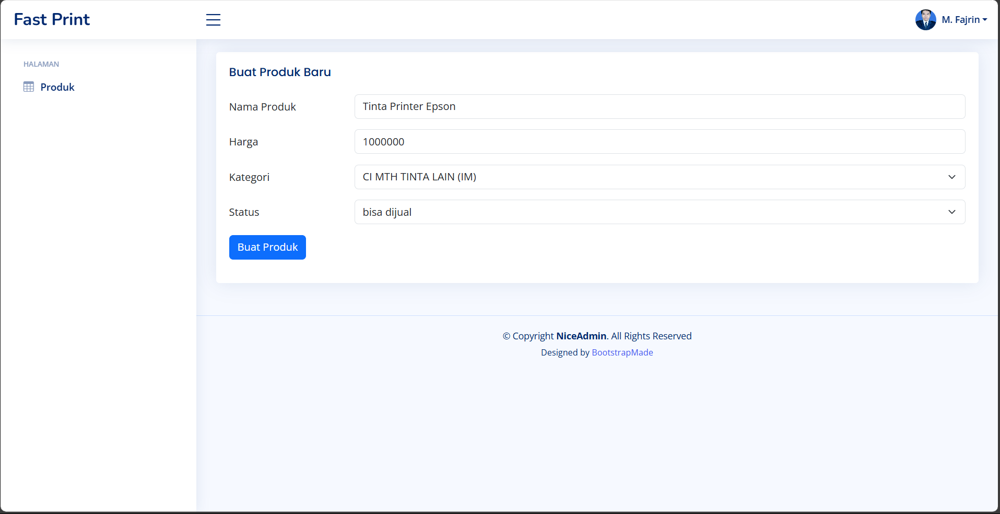

# Fast Print - Tes Junior Programmer

## Get Started

### Creating Virtual Environment

```sh
python -m venv venv
```

### Enter the Virtual Environment

- Windows

```powershell
venv\Scripts\activate
```

- Linux

```bash
source venv\bin\activate
```

### Install Dependency

```bash
pip install -r requirements.txt
```

### Create PostgreSQL Database

```sh
CREATE DATABASE <YOUR_DATABASE_NAME>;
```

### Create .env file

```sh
cp .env.example .env
```

### Configure .Env

```sh
# DATABASE CONFIG

DB_NAME=
DB_USER=
DB_PASSWORD=
DB_HOST=
DB_PORT=
```

### Run Database Migration

```sh
# apabila migration gagal karena value dari .env tidak terbarui
# tutup dan buat terminal baru

python manage.py makemigrations
python manage.py migrate
```

### Run Django Application

```sh
python manage.py runserver
```

## Screenshots

### Halaman Dashboard


### Mengambil data dari API


### Form tambah data



### Sukses menambahkan data


### Filter data


### Form update data


### konfirmasi hapus data pada Form update


### Konfirmasi Hapus Data


### Notifikasi Hapus Data


